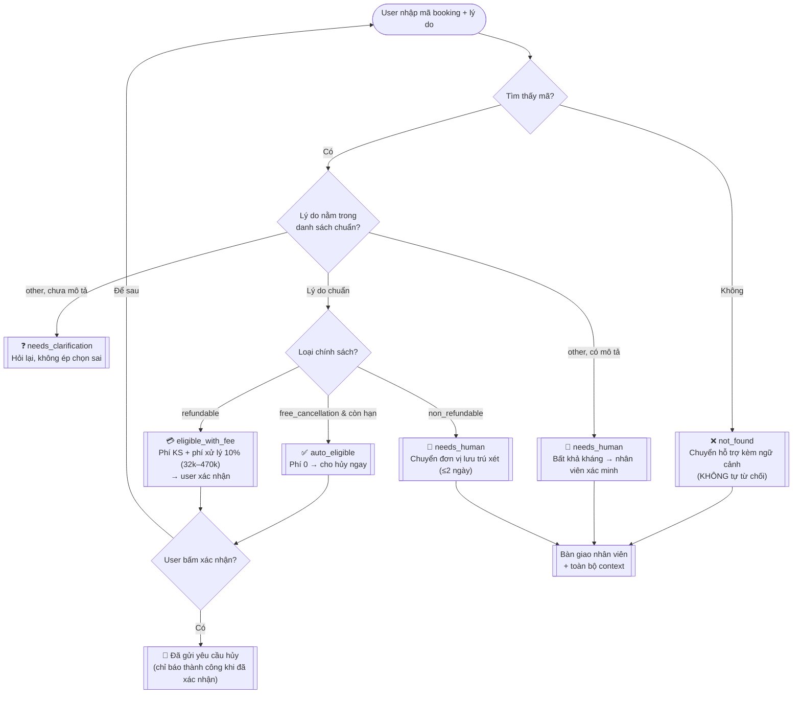
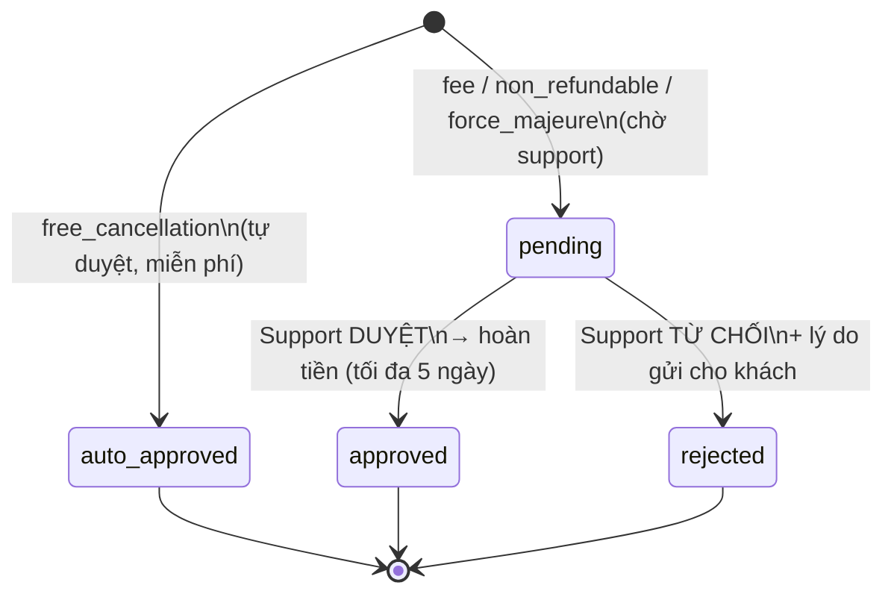

# Flow — Luồng hủy/đổi booking (Checkpoint 1)

Flow end-to-end gồm **happy path + error path**. Ở CP1 khối quyết định là rule-based mock;
ở CP2 khối `evaluateCancellation()` được thay bằng AI (LLM + RAG chính sách) — phần còn lại giữ nguyên.

## Sơ đồ quyết định (as-is của prototype)

## Vòng đời yêu cầu sau khi gửi (USER ↔ SUPPORT)

Sau khi user gửi, yêu cầu được lưu vào kho dùng chung (localStorage). Bộ phận hỗ trợ /
đơn vị lưu trú duyệt hoặc từ chối ở `admin.html`; trạng thái cập nhật ngay sang trang user.

- User xem trạng thái ở panel **"Yêu cầu của tôi"** (trang khách hàng).
- Support thao tác ở **Trang hỗ trợ** (`admin.html`): hàng đợi `pending` + nút Duyệt/Từ chối.
- Hai trang đồng bộ realtime qua sự kiện `storage` (mở 2 tab để thấy).

## Map sang 4 paths của SPEC

| Path | Nhánh trong sơ đồ | Trạng thái engine |
|---|---|---|
| **Happy** | free_until còn hạn → xác nhận → gửi yêu cầu | `auto_eligible` → `confirm` |
| **Low-confidence** | lý do "other" → hỏi lại / cần xác minh | `needs_clarification`, `needs_human` |
| **Failure** | mã sai → chuyển hỗ trợ, không từ chối oan | `not_found` |
| **Correction** | "Để sau" / quay lại nhập lại; escalate kèm context để người sửa | nút `reset`, handoff bundle |

## Phân công task CP1 (theo slide Day 06)

| Task | File / việc | Trạng thái |
|---|---|---|
| Vẽ flow (Mermaid) | `docs/flow.md` | ✅ |
| Dựng mockup end-to-end | `index.html`, `styles.css`, `src/app.js` | ✅ |
| Lấy data | `src/data.js` (booking + chính sách mẫu) | ✅ |
| Tối ưu prompt (chuẩn bị AI) | `docs/ai-prompt.md` | ✅ |
| Code phần AI (điểm cắm) | `src/decision-engine.js → evaluateCancellation()` | ✅ stub, CP2 thay bằng AI |
| Chọn 1 flow để gắn AI | Flow hủy/đổi booking | ✅ |
